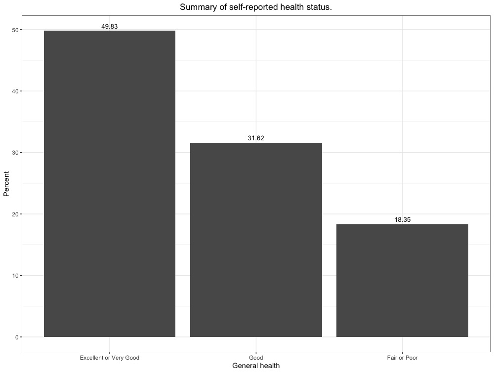
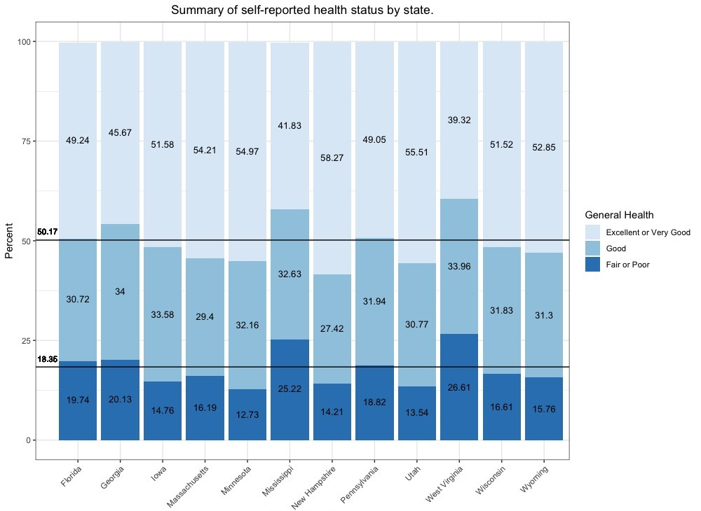
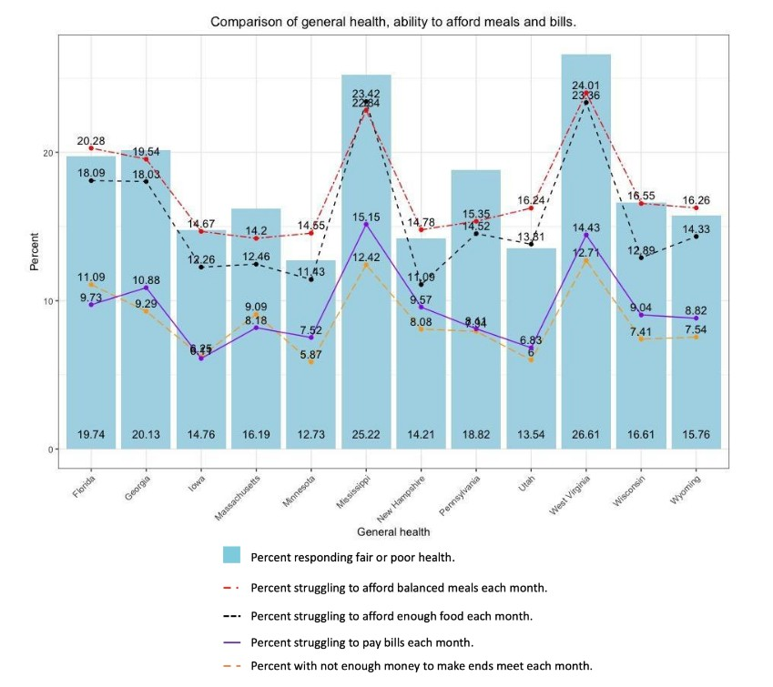

## A Glimpse of Food and Housing Insecurity within the United States
### Summary of Behavioral Risk Factor Surveillance System Survey 2017 - Food and Housing Data

Studies unequivocally demonstrate a link between food and housing insecurity within the United states. While efforts are being made to improve general material conditions, understanding our national need is difficult. A survey administered by the Centers for Disease Control and Prevention (CDC) seeks to illuminate these underlying issues - the [Behavioral Risk Factor Surveillance System](https://www.cdc.gov/brfss/) (BRFSS). The BRFSS is administered anually to a cohort of residents in all 50 states as well as each territory in order to better understand health-related risk behaviors. Below is a summary of 2017 survey food and housing responses from 12 states that participated in this section of the questionnaire. 

#### Data Brief
Data and metadata from the BRFSS survey was obtained and cleaned to meet [Data Administration Management Association's](https://dama.org/) (DAMA) data quality and documentation standards. Food and housing information comes from an optional Social Determinants of Health (SDoH) module and was offered to respondents in 12 states: Florida, Georgia, Iowa, Massachusetts, Minnesota, Mississippi, New Hampshire, Pennsylvania, Utah, West Virginia, Wisconsin, and Wyoming. States listed represent about 15% of our total population and their weighted results are generalized to the remaining 85%. These questions were offered consistently from 2009 to 2015, but were excluded in 2016, 2018 and 2019; thus, our most recent dataset available for comparison is from 2017 (at time of analysis in 2019). The BRFSS uses a weighting system to better generalize results to the population writ large. This was taken into account during analysis. 

2017's social determinants of health questionnaire included three questions on food and housing insecurity and one on general financial health:
1) “Was there a time when you were not able to pay your mortgage, rent or utility bills?”\
Response Options: (“Yes” or “No”)

2) “The food that I bought just didn’t last, and I didn’t have money to get more.”\
Response Options: (“Often true,” “Sometimes true” or “Never true”)

3) “Often or sometimes true” in response to the statement “I couldn’t afford to eat balanced meals.”\
Response Options: (“Often true,” “Sometimes true” or “Never true”)

4) “In general, how do your finances usually work out at the end of the month?”\
Response Options: (“End up with some money left over,” “Have just enough money to make ends meet” or “Not enough money to make ends meet.”)

While the main survey asks respondents about general and specific health information, the focus here will be their question on general health: “Would you say that
your general health is:” (Excellent, Very Good, Good, Fair, Poor, Don’t Know/Not Sure and Refused). These response options were grouped and reduced to three categories for ease of analysis: poor or fair health, good health, and very good or excellent health. Of the states questioned, average response rates ranged from 32.8% to 64.1% with a median of 46.3%. 

Target question response rates from the 12 sample states: 
| Survey Question | Number of Responses |
| --- | --- |
| “Was there a time when you were not able to pay your mortgage, rent or utility bills?” | 88,249 |
| “The food that I bought just didn’t last, and I didn’t have money to get more.” | 88,016 |
| “Often or sometimes true” in response to the statement “I couldn’t afford to eat balanced meals.” | 87,973 |
| “In general, how do your finances usually work out at the end of the month?” | 88,249 |

#### Results
Nationally, 48.7 million people responded to the general health status question with weighted frequencies of 18.35% (95% CI: 18.34—18.36) for poor or fair health, 31.62% (95% CI: 31.60—31.63) for good health, and 49.83% (95% CI: 49.81—49.84) for very good or excellent health (fig. 1). Figure 2 breaks this down further and demonstrates response to general health by state. A majority of respondents reported health status as "good" or "fair or poor" at 50.17%. Of that 50.17%, 18.36% of respondents answered "fair or poor."

##### Figure 1

##### Figure 2

Figure 3 shows the percentage of people who report having "poor or fair" general health by state compared to percent indicating financial insecurity. Percentage of the population experiencing food, housing, and/or financial insecurity increases as more respondents report "poor or fair" general health.

##### Figure 3

### References

1. USDA ERS - Key Statistics &amp; Graphics. (n.d.). Retrieved April 4, 2018, from
https://www.ers.usda.gov/topics/food-nutrition-assistance/food-security-in-the-us/key-
statistics-graphics.aspx
2. USDA ERS - Key Statistics &amp; Graphics. (n.d.). Retrieved April 4, 2018, from
https://www.ers.usda.gov/topics/food-nutrition-assistance/food-security-in-the-us/key-
statistics-graphics.aspx
3. Stahre, M., VanEenwyk, J., Siegel, P., & Njai, R. (2015). Housing Insecurity and the
Association With Health Outcomes and Unhealthy Behaviors, Washington State, 2011.
Preventing Chronic Disease, <
4. Charkhchi, P., Fazeli Dehkordy, S., & Carlos, R. C. (2018). Housing and Food Insecurity,
Care Access, and Health Status Among the Chronically Ill: An Analysis of the Behavioral
Risk Factor Surveillance System. Journal of General Internal Medicine.
https://doi.org/10.1007/s11606-017-4255-z
5. Gundersen, C., & Ziliak, J. P. (2015). Food Insecurity And Health Outcomes. Health
Affairs (Project Hope), 34(11), 1830–1839. https://doi.org/10.1377/hlthaff.2015.0645
6. CDC - BRFSS. (n.d.). Retrieved April 8, 2018, from https://www.cdc.gov/brfss/
7. CDC. (2015). Behavioral Risk Factor Surveillance System Weighting BRFSS Data
Introduction: Weighting Rationale. Retrieved from
https://www.cdc.gov/brfss/annual_data/2015/pdf/weighting_the-
data_webpage_content.pdf
8. The Centers for Medicare & Medicaid Services. A framework for Medicaid programs to
address social determinants of health: food insecurity and housing instability. Final
Report. The National Quality Forum. December 2017. Pdf. Retrieved from:
http://www.qualityforum.org/Publications/2017/12/Food_Insecurity_and_Housing_Inst
ability_Final_Report.aspx
